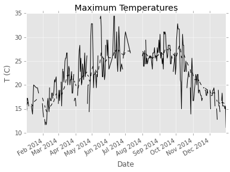
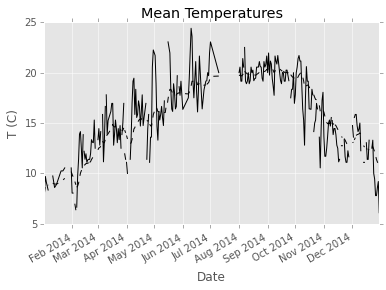

# Study on Weather in Palo Alto during 2014

Import the necessary libraries:

    import numpy as np
    import pandas as pd
    import matplotlib.pyplot as plt
    plt.style.use('ggplot')
    from datetime import datetime
    
    %matplotlib inline

Load and inspect the data:

    data = pd.read_csv('630613.csv', parse_dates=True, index_col=5)

    data.head()

<table border="1" class="dataframe">
  <thead>
    <tr style="text-align: right;">
      <th></th>
      <th>STATION</th>
      <th>STATION_NAME</th>
      <th>ELEVATION</th>
      <th>LATITUDE</th>
      <th>LONGITUDE</th>
      <th>MDPR</th>
      <th>Measurement Flag</th>
      <th>Quality Flag</th>
      <th>Source Flag</th>
      <th>Time of Observation</th>
      <th>...</th>
      <th>TMIN</th>
      <th>Measurement Flag.4</th>
      <th>Quality Flag.4</th>
      <th>Source Flag.4</th>
      <th>Time of Observation.4</th>
      <th>TOBS</th>
      <th>Measurement Flag.5</th>
      <th>Quality Flag.5</th>
      <th>Source Flag.5</th>
      <th>Time of Observation.5</th>
    </tr>
    <tr>
      <th>DATE</th>
      <th></th>
      <th></th>
      <th></th>
      <th></th>
      <th></th>
      <th></th>
      <th></th>
      <th></th>
      <th></th>
      <th></th>
      <th></th>
      <th></th>
      <th></th>
      <th></th>
      <th></th>
      <th></th>
      <th></th>
      <th></th>
      <th></th>
      <th></th>
      <th></th>
    </tr>
  </thead>
  <tbody>
    <tr>
      <th>2014-01-08</th>
      <td>GHCND:US1CASC0017</td>
      <td>PALO ALTO 1.2 NE CA US</td>
      <td>9.8</td>
      <td>37.4516</td>
      <td>-122.1486</td>
      <td>-9999</td>
      <td></td>
      <td></td>
      <td></td>
      <td>9999</td>
      <td>...</td>
      <td>-9999</td>
      <td></td>
      <td></td>
      <td></td>
      <td>9999</td>
      <td>-9999</td>
      <td></td>
      <td></td>
      <td></td>
      <td>9999</td>
    </tr>
    <tr>
      <th>2014-01-09</th>
      <td>GHCND:US1CASC0017</td>
      <td>PALO ALTO 1.2 NE CA US</td>
      <td>9.8</td>
      <td>37.4516</td>
      <td>-122.1486</td>
      <td>-9999</td>
      <td></td>
      <td></td>
      <td></td>
      <td>9999</td>
      <td>...</td>
      <td>-9999</td>
      <td></td>
      <td></td>
      <td></td>
      <td>9999</td>
      <td>-9999</td>
      <td></td>
      <td></td>
      <td></td>
      <td>9999</td>
    </tr>
    <tr>
      <th>2014-01-29</th>
      <td>GHCND:US1CASC0017</td>
      <td>PALO ALTO 1.2 NE CA US</td>
      <td>9.8</td>
      <td>37.4516</td>
      <td>-122.1486</td>
      <td>-9999</td>
      <td></td>
      <td></td>
      <td></td>
      <td>9999</td>
      <td>...</td>
      <td>-9999</td>
      <td></td>
      <td></td>
      <td></td>
      <td>9999</td>
      <td>-9999</td>
      <td></td>
      <td></td>
      <td></td>
      <td>9999</td>
    </tr>
    <tr>
      <th>2014-01-30</th>
      <td>GHCND:US1CASC0017</td>
      <td>PALO ALTO 1.2 NE CA US</td>
      <td>9.8</td>
      <td>37.4516</td>
      <td>-122.1486</td>
      <td>-9999</td>
      <td></td>
      <td></td>
      <td></td>
      <td>9999</td>
      <td>...</td>
      <td>-9999</td>
      <td></td>
      <td></td>
      <td></td>
      <td>9999</td>
      <td>-9999</td>
      <td></td>
      <td></td>
      <td></td>
      <td>9999</td>
    </tr>
    <tr>
      <th>2014-02-02</th>
      <td>GHCND:US1CASC0017</td>
      <td>PALO ALTO 1.2 NE CA US</td>
      <td>9.8</td>
      <td>37.4516</td>
      <td>-122.1486</td>
      <td>-9999</td>
      <td></td>
      <td></td>
      <td></td>
      <td>9999</td>
      <td>...</td>
      <td>-9999</td>
      <td></td>
      <td></td>
      <td></td>
      <td>9999</td>
      <td>-9999</td>
      <td></td>
      <td></td>
      <td></td>
      <td>9999</td>
    </tr>
  </tbody>
</table>

5 rows × 35 columns

    data.info()

    <class 'pandas.core.frame.DataFrame'>
    DatetimeIndex: 358 entries, 2014-01-08 to 2014-12-31
    Data columns (total 35 columns):
    STATION                  358 non-null object
    STATION_NAME             358 non-null object
    ELEVATION                358 non-null float64
    LATITUDE                 358 non-null float64
    LONGITUDE                358 non-null float64
    MDPR                     358 non-null int64
    Measurement Flag         358 non-null object
    Quality Flag             358 non-null object
    Source Flag              358 non-null object
    Time of Observation      358 non-null int64
    DAPR                     358 non-null int64
    Measurement Flag.1       358 non-null object
    Quality Flag.1           358 non-null object
    Source Flag.1            358 non-null object
    Time of Observation.1    358 non-null int64
    PRCP                     358 non-null int64
    Measurement Flag.2       358 non-null object
    Quality Flag.2           358 non-null object
    Source Flag.2            358 non-null object
    Time of Observation.2    358 non-null int64
    TMAX                     358 non-null int64
    Measurement Flag.3       358 non-null object
    Quality Flag.3           358 non-null object
    Source Flag.3            358 non-null object
    Time of Observation.3    358 non-null int64
    TMIN                     358 non-null int64
    Measurement Flag.4       358 non-null object
    Quality Flag.4           358 non-null object
    Source Flag.4            358 non-null object
    Time of Observation.4    358 non-null int64
    TOBS                     358 non-null int64
    Measurement Flag.5       358 non-null object
    Quality Flag.5           358 non-null object
    Source Flag.5            358 non-null object
    Time of Observation.5    358 non-null int64
    dtypes: float64(3), int64(12), object(20)
    memory usage: 100.7+ KB

    data.describe().T

<table border="1" class="dataframe">
  <thead>
    <tr style="text-align: right;">
      <th></th>
      <th>count</th>
      <th>mean</th>
      <th>std</th>
      <th>min</th>
      <th>25%</th>
      <th>50%</th>
      <th>75%</th>
      <th>max</th>
    </tr>
  </thead>
  <tbody>
    <tr>
      <th>ELEVATION</th>
      <td>358</td>
      <td>7.944134</td>
      <td>0.800285</td>
      <td>7.6000</td>
      <td>7.6000</td>
      <td>7.6000</td>
      <td>7.6000</td>
      <td>9.8000</td>
    </tr>
    <tr>
      <th>LATITUDE</th>
      <td>358</td>
      <td>37.444851</td>
      <td>0.002910</td>
      <td>37.4436</td>
      <td>37.4436</td>
      <td>37.4436</td>
      <td>37.4436</td>
      <td>37.4516</td>
    </tr>
    <tr>
      <th>LONGITUDE</th>
      <td>358</td>
      <td>-122.141514</td>
      <td>0.003056</td>
      <td>-122.1486</td>
      <td>-122.1402</td>
      <td>-122.1402</td>
      <td>-122.1402</td>
      <td>-122.1402</td>
    </tr>
    <tr>
      <th>MDPR</th>
      <td>358</td>
      <td>-9999.000000</td>
      <td>0.000000</td>
      <td>-9999.0000</td>
      <td>-9999.0000</td>
      <td>-9999.0000</td>
      <td>-9999.0000</td>
      <td>-9999.0000</td>
    </tr>
    <tr>
      <th>Time of Observation</th>
      <td>358</td>
      <td>9999.000000</td>
      <td>0.000000</td>
      <td>9999.0000</td>
      <td>9999.0000</td>
      <td>9999.0000</td>
      <td>9999.0000</td>
      <td>9999.0000</td>
    </tr>
    <tr>
      <th>DAPR</th>
      <td>358</td>
      <td>-9999.000000</td>
      <td>0.000000</td>
      <td>-9999.0000</td>
      <td>-9999.0000</td>
      <td>-9999.0000</td>
      <td>-9999.0000</td>
      <td>-9999.0000</td>
    </tr>
    <tr>
      <th>Time of Observation.1</th>
      <td>358</td>
      <td>9999.000000</td>
      <td>0.000000</td>
      <td>9999.0000</td>
      <td>9999.0000</td>
      <td>9999.0000</td>
      <td>9999.0000</td>
      <td>9999.0000</td>
    </tr>
    <tr>
      <th>PRCP</th>
      <td>358</td>
      <td>22.717877</td>
      <td>79.004104</td>
      <td>0.0000</td>
      <td>0.0000</td>
      <td>0.0000</td>
      <td>5.0000</td>
      <td>1003.0000</td>
    </tr>
    <tr>
      <th>Time of Observation.2</th>
      <td>358</td>
      <td>2238.949721</td>
      <td>3346.281577</td>
      <td>800.0000</td>
      <td>800.0000</td>
      <td>800.0000</td>
      <td>800.0000</td>
      <td>9999.0000</td>
    </tr>
    <tr>
      <th>TMAX</th>
      <td>358</td>
      <td>-1463.332402</td>
      <td>3797.247070</td>
      <td>-9999.0000</td>
      <td>156.0000</td>
      <td>200.0000</td>
      <td>256.0000</td>
      <td>344.0000</td>
    </tr>
    <tr>
      <th>Time of Observation.3</th>
      <td>358</td>
      <td>2316.036313</td>
      <td>3417.642231</td>
      <td>800.0000</td>
      <td>800.0000</td>
      <td>800.0000</td>
      <td>800.0000</td>
      <td>9999.0000</td>
    </tr>
    <tr>
      <th>TMIN</th>
      <td>358</td>
      <td>-1569.120112</td>
      <td>3750.044750</td>
      <td>-9999.0000</td>
      <td>45.5000</td>
      <td>89.0000</td>
      <td>117.0000</td>
      <td>167.0000</td>
    </tr>
    <tr>
      <th>Time of Observation.4</th>
      <td>358</td>
      <td>2316.036313</td>
      <td>3417.642231</td>
      <td>800.0000</td>
      <td>800.0000</td>
      <td>800.0000</td>
      <td>800.0000</td>
      <td>9999.0000</td>
    </tr>
    <tr>
      <th>TOBS</th>
      <td>358</td>
      <td>-1547.737430</td>
      <td>3759.582587</td>
      <td>-9999.0000</td>
      <td>67.0000</td>
      <td>114.0000</td>
      <td>144.0000</td>
      <td>261.0000</td>
    </tr>
    <tr>
      <th>Time of Observation.5</th>
      <td>358</td>
      <td>2316.036313</td>
      <td>3417.642231</td>
      <td>800.0000</td>
      <td>800.0000</td>
      <td>800.0000</td>
      <td>800.0000</td>
      <td>9999.0000</td>
    </tr>
  </tbody>
</table>

### Clean the data:

    data = data.replace([-9999, 9999], [np.nan, np.nan])

    data.describe().T

<table border="1" class="dataframe">
  <thead>
    <tr style="text-align: right;">
      <th></th>
      <th>count</th>
      <th>mean</th>
      <th>std</th>
      <th>min</th>
      <th>25%</th>
      <th>50%</th>
      <th>75%</th>
      <th>max</th>
    </tr>
  </thead>
  <tbody>
    <tr>
      <th>ELEVATION</th>
      <td>358</td>
      <td>7.944134</td>
      <td>0.800285</td>
      <td>7.6000</td>
      <td>7.6000</td>
      <td>7.6000</td>
      <td>7.6000</td>
      <td>9.8000</td>
    </tr>
    <tr>
      <th>LATITUDE</th>
      <td>358</td>
      <td>37.444851</td>
      <td>0.002910</td>
      <td>37.4436</td>
      <td>37.4436</td>
      <td>37.4436</td>
      <td>37.4436</td>
      <td>37.4516</td>
    </tr>
    <tr>
      <th>LONGITUDE</th>
      <td>358</td>
      <td>-122.141514</td>
      <td>0.003056</td>
      <td>-122.1486</td>
      <td>-122.1402</td>
      <td>-122.1402</td>
      <td>-122.1402</td>
      <td>-122.1402</td>
    </tr>
    <tr>
      <th>MDPR</th>
      <td>0</td>
      <td>NaN</td>
      <td>NaN</td>
      <td>NaN</td>
      <td>NaN</td>
      <td>NaN</td>
      <td>NaN</td>
      <td>NaN</td>
    </tr>
    <tr>
      <th>Time of Observation</th>
      <td>0</td>
      <td>NaN</td>
      <td>NaN</td>
      <td>NaN</td>
      <td>NaN</td>
      <td>NaN</td>
      <td>NaN</td>
      <td>NaN</td>
    </tr>
    <tr>
      <th>DAPR</th>
      <td>0</td>
      <td>NaN</td>
      <td>NaN</td>
      <td>NaN</td>
      <td>NaN</td>
      <td>NaN</td>
      <td>NaN</td>
      <td>NaN</td>
    </tr>
    <tr>
      <th>Time of Observation.1</th>
      <td>0</td>
      <td>NaN</td>
      <td>NaN</td>
      <td>NaN</td>
      <td>NaN</td>
      <td>NaN</td>
      <td>NaN</td>
      <td>NaN</td>
    </tr>
    <tr>
      <th>PRCP</th>
      <td>358</td>
      <td>22.717877</td>
      <td>79.004104</td>
      <td>0.0000</td>
      <td>0.0000</td>
      <td>0.0000</td>
      <td>5.0000</td>
      <td>1003.0000</td>
    </tr>
    <tr>
      <th>Time of Observation.2</th>
      <td>302</td>
      <td>800.000000</td>
      <td>0.000000</td>
      <td>800.0000</td>
      <td>800.0000</td>
      <td>800.0000</td>
      <td>800.0000</td>
      <td>800.0000</td>
    </tr>
    <tr>
      <th>TMAX</th>
      <td>299</td>
      <td>220.963211</td>
      <td>51.654979</td>
      <td>111.0000</td>
      <td>183.0000</td>
      <td>222.0000</td>
      <td>258.5000</td>
      <td>344.0000</td>
    </tr>
    <tr>
      <th>Time of Observation.3</th>
      <td>299</td>
      <td>800.000000</td>
      <td>0.000000</td>
      <td>800.0000</td>
      <td>800.0000</td>
      <td>800.0000</td>
      <td>800.0000</td>
      <td>800.0000</td>
    </tr>
    <tr>
      <th>TMIN</th>
      <td>299</td>
      <td>94.301003</td>
      <td>36.578724</td>
      <td>-22.0000</td>
      <td>72.0000</td>
      <td>100.0000</td>
      <td>119.5000</td>
      <td>167.0000</td>
    </tr>
    <tr>
      <th>Time of Observation.4</th>
      <td>299</td>
      <td>800.000000</td>
      <td>0.000000</td>
      <td>800.0000</td>
      <td>800.0000</td>
      <td>800.0000</td>
      <td>800.0000</td>
      <td>800.0000</td>
    </tr>
    <tr>
      <th>TOBS</th>
      <td>299</td>
      <td>119.903010</td>
      <td>39.704791</td>
      <td>0.0000</td>
      <td>94.0000</td>
      <td>122.0000</td>
      <td>144.0000</td>
      <td>261.0000</td>
    </tr>
    <tr>
      <th>Time of Observation.5</th>
      <td>299</td>
      <td>800.000000</td>
      <td>0.000000</td>
      <td>800.0000</td>
      <td>800.0000</td>
      <td>800.0000</td>
      <td>800.0000</td>
      <td>800.0000</td>
    </tr>
  </tbody>
</table>

    data['TMIN'] = data['TMIN'] / 10. # All temperatures to tenths. Convert temperatures to Celcius.

    data['TMAX'] = data['TMAX'] / 10. # All temperatures to tenths. Convert temperatures to Celcius.

### Temperatures in Palo Alto

    data['TMEAN'] = pd.DataFrame(data, columns=['TMIN','TMAX']).mean(axis=1)
    pd.DataFrame(data, columns=['TMIN','TMAX','TMEAN']).describe().T

<table border="1" class="dataframe">
  <thead>
    <tr style="text-align: right;">
      <th></th>
      <th>count</th>
      <th>mean</th>
      <th>std</th>
      <th>min</th>
      <th>25%</th>
      <th>50%</th>
      <th>75%</th>
      <th>max</th>
    </tr>
  </thead>
  <tbody>
    <tr>
      <th>TMIN</th>
      <td>299</td>
      <td>9.430100</td>
      <td>3.657872</td>
      <td>-2.2</td>
      <td>7.2</td>
      <td>10.00</td>
      <td>11.95</td>
      <td>16.7</td>
    </tr>
    <tr>
      <th>TMAX</th>
      <td>299</td>
      <td>22.096321</td>
      <td>5.165498</td>
      <td>11.1</td>
      <td>18.3</td>
      <td>22.20</td>
      <td>25.85</td>
      <td>34.4</td>
    </tr>
    <tr>
      <th>TMEAN</th>
      <td>299</td>
      <td>15.763211</td>
      <td>3.966303</td>
      <td>6.1</td>
      <td>12.8</td>
      <td>15.85</td>
      <td>19.15</td>
      <td>24.4</td>
    </tr>
  </tbody>
</table>

    data.TMIN.plot(style='k')
    ax = pd.ewma(data.TMIN, 10).plot(x='Date',y='T (C)',style='k--', title='Minimum Temperatures')
    ax.set_xlabel('Date')
    ax.set_ylabel('T (C)')

    <matplotlib.text.Text at 0x1117f48d0>

    data.TMAX.plot(style='k')
    ax = pd.ewma(data.TMAX, 10).plot(x='Date',y='T (C)',style='k--', title='Maximum Temperatures')
    ax.set_xlabel('Date')
    ax.set_ylabel('T (C)')

    <matplotlib.text.Text at 0x1118be710>

    data.TMEAN.plot(style='k')
    ax = pd.ewma(data.TMEAN, 10).plot(x='Date',y='T (C)',style='k--', title='Mean Temperatures')
    ax.set_xlabel('Date')
    ax.set_ylabel('T (C)')

    <matplotlib.text.Text at 0x1118befd0>

### Observations:

The plots show a general increase in temperature until mid-September. After that, there is a sharp decrease in temperature until the end of November. At the beginning of December there is a small spike in the average temperature.

## Precipitation

    data['PRCP'] = data['PRCP'] / 10. # convert to mm

    by_month = data.groupby(lambda x: x.month)

    data_by_month = by_month.apply(sum)

    ax = data_by_month['PRCP'].plot(kind='bar', title='Monthly Precipitation')
    ax.set_xlabel('month')
    ax.set_xticklabels(['Jan', 'Feb', 'Mar', 'Apr', 'May', 'Jun', 'Jul', 'Aug', 'Sep', 'Oct', 'Nov', 'Dec'])
    ax.set_ylabel('Precipitation (mm)')

    <matplotlib.text.Text at 0x111dc4d10>

### Observations:

The plot shows December was the rainest month of 2014.

    
