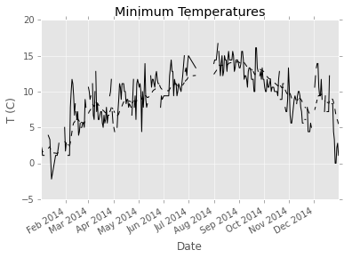

# Study on Weather in Palo Alto during 2014

Import the necessary libraries:

    import numpy as np
    import pandas as pd
    import matplotlib.pyplot as plt
    plt.style.use('ggplot')
    from datetime import datetime
    
    %matplotlib inline

Load and inspect the data:

    data = pd.read_csv('613584.csv', parse_dates=True, index_col=5)

    data.head()

<table border="1" class="dataframe">
  <thead>
    <tr style="text-align: right;">
      <th></th>
      <th>STATION</th>
      <th>STATION_NAME</th>
      <th>ELEVATION</th>
      <th>LATITUDE</th>
      <th>LONGITUDE</th>
      <th>MDPR</th>
      <th>Measurement Flag</th>
      <th>Quality Flag</th>
      <th>Source Flag</th>
      <th>Time of Observation</th>
      <th>...</th>
      <th>TMIN</th>
      <th>Measurement Flag.4</th>
      <th>Quality Flag.4</th>
      <th>Source Flag.4</th>
      <th>Time of Observation.4</th>
      <th>TOBS</th>
      <th>Measurement Flag.5</th>
      <th>Quality Flag.5</th>
      <th>Source Flag.5</th>
      <th>Time of Observation.5</th>
    </tr>
    <tr>
      <th>DATE</th>
      <th></th>
      <th></th>
      <th></th>
      <th></th>
      <th></th>
      <th></th>
      <th></th>
      <th></th>
      <th></th>
      <th></th>
      <th></th>
      <th></th>
      <th></th>
      <th></th>
      <th></th>
      <th></th>
      <th></th>
      <th></th>
      <th></th>
      <th></th>
      <th></th>
    </tr>
  </thead>
  <tbody>
    <tr>
      <th>2015-01-19</th>
      <td>GHCND:US1CASC0017</td>
      <td>PALO ALTO 1.2 NE CA US</td>
      <td>9.8</td>
      <td>37.4516</td>
      <td>-122.1486</td>
      <td>-9999</td>
      <td></td>
      <td></td>
      <td></td>
      <td>9999</td>
      <td>...</td>
      <td>-9999</td>
      <td></td>
      <td></td>
      <td></td>
      <td>9999</td>
      <td>-9999</td>
      <td></td>
      <td></td>
      <td></td>
      <td>9999</td>
    </tr>
    <tr>
      <th>2015-02-07</th>
      <td>GHCND:US1CASC0017</td>
      <td>PALO ALTO 1.2 NE CA US</td>
      <td>9.8</td>
      <td>37.4516</td>
      <td>-122.1486</td>
      <td>-9999</td>
      <td></td>
      <td></td>
      <td></td>
      <td>9999</td>
      <td>...</td>
      <td>-9999</td>
      <td></td>
      <td></td>
      <td></td>
      <td>9999</td>
      <td>-9999</td>
      <td></td>
      <td></td>
      <td></td>
      <td>9999</td>
    </tr>
    <tr>
      <th>2015-02-08</th>
      <td>GHCND:US1CASC0017</td>
      <td>PALO ALTO 1.2 NE CA US</td>
      <td>9.8</td>
      <td>37.4516</td>
      <td>-122.1486</td>
      <td>-9999</td>
      <td></td>
      <td></td>
      <td></td>
      <td>9999</td>
      <td>...</td>
      <td>-9999</td>
      <td></td>
      <td></td>
      <td></td>
      <td>9999</td>
      <td>-9999</td>
      <td></td>
      <td></td>
      <td></td>
      <td>9999</td>
    </tr>
    <tr>
      <th>2015-02-09</th>
      <td>GHCND:US1CASC0017</td>
      <td>PALO ALTO 1.2 NE CA US</td>
      <td>9.8</td>
      <td>37.4516</td>
      <td>-122.1486</td>
      <td>-9999</td>
      <td></td>
      <td></td>
      <td></td>
      <td>9999</td>
      <td>...</td>
      <td>-9999</td>
      <td></td>
      <td></td>
      <td></td>
      <td>9999</td>
      <td>-9999</td>
      <td></td>
      <td></td>
      <td></td>
      <td>9999</td>
    </tr>
    <tr>
      <th>2015-03-11</th>
      <td>GHCND:US1CASC0017</td>
      <td>PALO ALTO 1.2 NE CA US</td>
      <td>9.8</td>
      <td>37.4516</td>
      <td>-122.1486</td>
      <td>-9999</td>
      <td></td>
      <td></td>
      <td></td>
      <td>9999</td>
      <td>...</td>
      <td>-9999</td>
      <td></td>
      <td></td>
      <td></td>
      <td>9999</td>
      <td>-9999</td>
      <td></td>
      <td></td>
      <td></td>
      <td>9999</td>
    </tr>
  </tbody>
</table>

5 rows × 35 columns

    data.info()

    <class 'pandas.core.frame.DataFrame'>
    DatetimeIndex: 227 entries, 2015-01-19 to 2015-09-26
    Data columns (total 35 columns):
    STATION                  227 non-null object
    STATION_NAME             227 non-null object
    ELEVATION                227 non-null float64
    LATITUDE                 227 non-null float64
    LONGITUDE                227 non-null float64
    MDPR                     227 non-null int64
    Measurement Flag         227 non-null object
    Quality Flag             227 non-null object
    Source Flag              227 non-null object
    Time of Observation      227 non-null int64
    DAPR                     227 non-null int64
    Measurement Flag.1       227 non-null object
    Quality Flag.1           227 non-null object
    Source Flag.1            227 non-null object
    Time of Observation.1    227 non-null int64
    PRCP                     227 non-null int64
    Measurement Flag.2       227 non-null object
    Quality Flag.2           227 non-null object
    Source Flag.2            227 non-null object
    Time of Observation.2    227 non-null int64
    TMAX                     227 non-null int64
    Measurement Flag.3       227 non-null object
    Quality Flag.3           227 non-null object
    Source Flag.3            227 non-null object
    Time of Observation.3    227 non-null int64
    TMIN                     227 non-null int64
    Measurement Flag.4       227 non-null object
    Quality Flag.4           227 non-null object
    Source Flag.4            227 non-null object
    Time of Observation.4    227 non-null int64
    TOBS                     227 non-null int64
    Measurement Flag.5       227 non-null object
    Quality Flag.5           227 non-null object
    Source Flag.5            227 non-null object
    Time of Observation.5    227 non-null int64
    dtypes: float64(3), int64(12), object(20)
    memory usage: 63.8+ KB

    data.describe().T

<table border="1" class="dataframe">
  <thead>
    <tr style="text-align: right;">
      <th></th>
      <th>count</th>
      <th>mean</th>
      <th>std</th>
      <th>min</th>
      <th>25%</th>
      <th>50%</th>
      <th>75%</th>
      <th>max</th>
    </tr>
  </thead>
  <tbody>
    <tr>
      <th>ELEVATION</th>
      <td>227</td>
      <td>7.725991</td>
      <td>0.512311</td>
      <td>7.6000</td>
      <td>7.6000</td>
      <td>7.6000</td>
      <td>7.6000</td>
      <td>9.8000</td>
    </tr>
    <tr>
      <th>LATITUDE</th>
      <td>227</td>
      <td>37.444058</td>
      <td>0.001863</td>
      <td>37.4436</td>
      <td>37.4436</td>
      <td>37.4436</td>
      <td>37.4436</td>
      <td>37.4516</td>
    </tr>
    <tr>
      <th>LONGITUDE</th>
      <td>227</td>
      <td>-122.140681</td>
      <td>0.001956</td>
      <td>-122.1486</td>
      <td>-122.1402</td>
      <td>-122.1402</td>
      <td>-122.1402</td>
      <td>-122.1402</td>
    </tr>
    <tr>
      <th>MDPR</th>
      <td>227</td>
      <td>-9866.687225</td>
      <td>1145.841571</td>
      <td>-9999.0000</td>
      <td>-9999.0000</td>
      <td>-9999.0000</td>
      <td>-9999.0000</td>
      <td>38.0000</td>
    </tr>
    <tr>
      <th>Time of Observation</th>
      <td>227</td>
      <td>9999.000000</td>
      <td>0.000000</td>
      <td>9999.0000</td>
      <td>9999.0000</td>
      <td>9999.0000</td>
      <td>9999.0000</td>
      <td>9999.0000</td>
    </tr>
    <tr>
      <th>DAPR</th>
      <td>227</td>
      <td>-9866.819383</td>
      <td>1144.695213</td>
      <td>-9999.0000</td>
      <td>-9999.0000</td>
      <td>-9999.0000</td>
      <td>-9999.0000</td>
      <td>4.0000</td>
    </tr>
    <tr>
      <th>Time of Observation.1</th>
      <td>227</td>
      <td>9999.000000</td>
      <td>0.000000</td>
      <td>9999.0000</td>
      <td>9999.0000</td>
      <td>9999.0000</td>
      <td>9999.0000</td>
      <td>9999.0000</td>
    </tr>
    <tr>
      <th>PRCP</th>
      <td>227</td>
      <td>-254.440529</td>
      <td>1609.861581</td>
      <td>-9999.0000</td>
      <td>0.0000</td>
      <td>0.0000</td>
      <td>0.0000</td>
      <td>401.0000</td>
    </tr>
    <tr>
      <th>Time of Observation.2</th>
      <td>227</td>
      <td>1569.960352</td>
      <td>2553.182968</td>
      <td>800.0000</td>
      <td>800.0000</td>
      <td>800.0000</td>
      <td>800.0000</td>
      <td>9999.0000</td>
    </tr>
    <tr>
      <th>TMAX</th>
      <td>227</td>
      <td>-442.026432</td>
      <td>2548.262075</td>
      <td>-9999.0000</td>
      <td>189.0000</td>
      <td>228.0000</td>
      <td>267.0000</td>
      <td>367.0000</td>
    </tr>
    <tr>
      <th>Time of Observation.3</th>
      <td>227</td>
      <td>1407.863436</td>
      <td>2290.271826</td>
      <td>800.0000</td>
      <td>800.0000</td>
      <td>800.0000</td>
      <td>800.0000</td>
      <td>9999.0000</td>
    </tr>
    <tr>
      <th>TMIN</th>
      <td>227</td>
      <td>-568.885463</td>
      <td>2514.279899</td>
      <td>-9999.0000</td>
      <td>56.0000</td>
      <td>94.0000</td>
      <td>128.0000</td>
      <td>172.0000</td>
    </tr>
    <tr>
      <th>Time of Observation.4</th>
      <td>227</td>
      <td>1407.863436</td>
      <td>2290.271826</td>
      <td>800.0000</td>
      <td>800.0000</td>
      <td>800.0000</td>
      <td>800.0000</td>
      <td>9999.0000</td>
    </tr>
    <tr>
      <th>TOBS</th>
      <td>227</td>
      <td>-543.365639</td>
      <td>2521.147736</td>
      <td>-9999.0000</td>
      <td>86.0000</td>
      <td>128.0000</td>
      <td>156.0000</td>
      <td>339.0000</td>
    </tr>
    <tr>
      <th>Time of Observation.5</th>
      <td>227</td>
      <td>1407.863436</td>
      <td>2290.271826</td>
      <td>800.0000</td>
      <td>800.0000</td>
      <td>800.0000</td>
      <td>800.0000</td>
      <td>9999.0000</td>
    </tr>
  </tbody>
</table>

### Clean the data:

    data = data.replace([-9999, 9999], [np.nan, np.nan])

    data.describe().T

<table border="1" class="dataframe">
  <thead>
    <tr style="text-align: right;">
      <th></th>
      <th>count</th>
      <th>mean</th>
      <th>std</th>
      <th>min</th>
      <th>25%</th>
      <th>50%</th>
      <th>75%</th>
      <th>max</th>
    </tr>
  </thead>
  <tbody>
    <tr>
      <th>ELEVATION</th>
      <td>227</td>
      <td>7.725991</td>
      <td>0.512311</td>
      <td>7.6000</td>
      <td>7.6000</td>
      <td>7.6000</td>
      <td>7.6000</td>
      <td>9.8000</td>
    </tr>
    <tr>
      <th>LATITUDE</th>
      <td>227</td>
      <td>37.444058</td>
      <td>0.001863</td>
      <td>37.4436</td>
      <td>37.4436</td>
      <td>37.4436</td>
      <td>37.4436</td>
      <td>37.4516</td>
    </tr>
    <tr>
      <th>LONGITUDE</th>
      <td>227</td>
      <td>-122.140681</td>
      <td>0.001956</td>
      <td>-122.1486</td>
      <td>-122.1402</td>
      <td>-122.1402</td>
      <td>-122.1402</td>
      <td>-122.1402</td>
    </tr>
    <tr>
      <th>MDPR</th>
      <td>3</td>
      <td>12.666667</td>
      <td>21.939310</td>
      <td>0.0000</td>
      <td>0.0000</td>
      <td>0.0000</td>
      <td>19.0000</td>
      <td>38.0000</td>
    </tr>
    <tr>
      <th>Time of Observation</th>
      <td>0</td>
      <td>NaN</td>
      <td>NaN</td>
      <td>NaN</td>
      <td>NaN</td>
      <td>NaN</td>
      <td>NaN</td>
      <td>NaN</td>
    </tr>
    <tr>
      <th>DAPR</th>
      <td>3</td>
      <td>2.666667</td>
      <td>1.154701</td>
      <td>2.0000</td>
      <td>2.0000</td>
      <td>2.0000</td>
      <td>3.0000</td>
      <td>4.0000</td>
    </tr>
    <tr>
      <th>Time of Observation.1</th>
      <td>0</td>
      <td>NaN</td>
      <td>NaN</td>
      <td>NaN</td>
      <td>NaN</td>
      <td>NaN</td>
      <td>NaN</td>
      <td>NaN</td>
    </tr>
    <tr>
      <th>PRCP</th>
      <td>221</td>
      <td>10.117647</td>
      <td>48.016140</td>
      <td>0.0000</td>
      <td>0.0000</td>
      <td>0.0000</td>
      <td>0.0000</td>
      <td>401.0000</td>
    </tr>
    <tr>
      <th>Time of Observation.2</th>
      <td>208</td>
      <td>800.000000</td>
      <td>0.000000</td>
      <td>800.0000</td>
      <td>800.0000</td>
      <td>800.0000</td>
      <td>800.0000</td>
      <td>800.0000</td>
    </tr>
    <tr>
      <th>TMAX</th>
      <td>212</td>
      <td>234.174528</td>
      <td>52.873476</td>
      <td>100.0000</td>
      <td>198.5000</td>
      <td>233.0000</td>
      <td>272.0000</td>
      <td>367.0000</td>
    </tr>
    <tr>
      <th>Time of Observation.3</th>
      <td>212</td>
      <td>800.000000</td>
      <td>0.000000</td>
      <td>800.0000</td>
      <td>800.0000</td>
      <td>800.0000</td>
      <td>800.0000</td>
      <td>800.0000</td>
    </tr>
    <tr>
      <th>TMIN</th>
      <td>212</td>
      <td>98.339623</td>
      <td>43.340028</td>
      <td>-11.0000</td>
      <td>67.0000</td>
      <td>100.0000</td>
      <td>129.2500</td>
      <td>172.0000</td>
    </tr>
    <tr>
      <th>Time of Observation.4</th>
      <td>212</td>
      <td>800.000000</td>
      <td>0.000000</td>
      <td>800.0000</td>
      <td>800.0000</td>
      <td>800.0000</td>
      <td>800.0000</td>
      <td>800.0000</td>
    </tr>
    <tr>
      <th>TOBS</th>
      <td>212</td>
      <td>125.665094</td>
      <td>47.248823</td>
      <td>-11.0000</td>
      <td>94.0000</td>
      <td>128.0000</td>
      <td>157.2500</td>
      <td>339.0000</td>
    </tr>
    <tr>
      <th>Time of Observation.5</th>
      <td>212</td>
      <td>800.000000</td>
      <td>0.000000</td>
      <td>800.0000</td>
      <td>800.0000</td>
      <td>800.0000</td>
      <td>800.0000</td>
      <td>800.0000</td>
    </tr>
  </tbody>
</table>

### Temperatures in Palo Alto

    data['TMEAN'] = pd.DataFrame(data, columns=['TMIN','TMAX']).mean(axis=1)
    pd.DataFrame(data, columns=['TMIN','TMAX','TMEAN']).describe().T

<table border="1" class="dataframe">
  <thead>
    <tr style="text-align: right;">
      <th></th>
      <th>count</th>
      <th>mean</th>
      <th>std</th>
      <th>min</th>
      <th>25%</th>
      <th>50%</th>
      <th>75%</th>
      <th>max</th>
    </tr>
  </thead>
  <tbody>
    <tr>
      <th>TMIN</th>
      <td>212</td>
      <td>98.339623</td>
      <td>43.340028</td>
      <td>-11.0</td>
      <td>67.0</td>
      <td>100</td>
      <td>129.25</td>
      <td>172.0</td>
    </tr>
    <tr>
      <th>TMAX</th>
      <td>212</td>
      <td>234.174528</td>
      <td>52.873476</td>
      <td>100.0</td>
      <td>198.5</td>
      <td>233</td>
      <td>272.00</td>
      <td>367.0</td>
    </tr>
    <tr>
      <th>TMEAN</th>
      <td>212</td>
      <td>166.257075</td>
      <td>44.853460</td>
      <td>44.5</td>
      <td>133.5</td>
      <td>167</td>
      <td>203.00</td>
      <td>261.5</td>
    </tr>
  </tbody>
</table>

    data.TMIN.plot().plot(style='k--')
    ax = pd.ewma(data.TMIN, 10).plot(x='Date',y='T (C)',style='k', title='Minimum Temperatures')
    ax.set_xlabel('Date')
    ax.set_ylabel('T (C)')

    <matplotlib.text.Text at 0x11568f1d0>

    data.TMAX.plot().plot(style='k--')
    ax = pd.ewma(data.TMAX, 10).plot(x='Date',y='T (C)',style='k', title='Maximum Temperatures')
    ax.set_xlabel('Date')
    ax.set_ylabel('T (C)')

    <matplotlib.text.Text at 0x11575d8d0>

    data.TMEAN.plot().plot(style='k--')
    ax = pd.ewma(data.TMEAN, 10).plot(x='Date',y='T (C)',style='k', title='Mean Temperatures')
    ax.set_xlabel('Date')
    ax.set_ylabel('T (C)')

    <matplotlib.text.Text at 0x11610c110>

### Results:

The plots show a general increase in temperature for the whole year of 2014.

    
